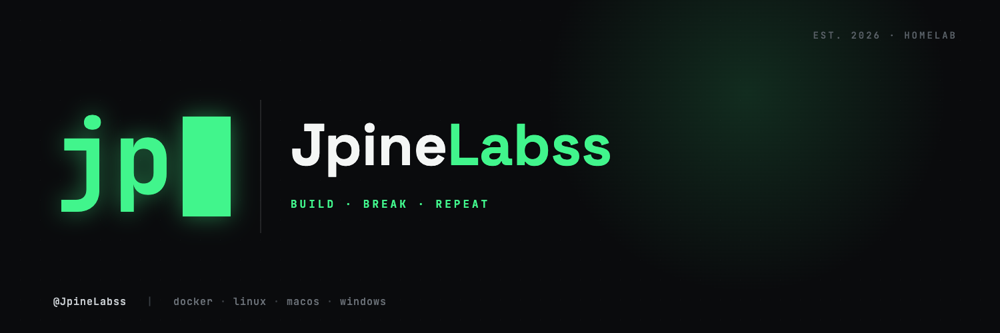

### No CS background — just AI-assisted engineering and a lot of curiosity.

Self-taught, learning by building: PhotoShare, a shortcut/hotkey macOS widget, and a home server stack running on a mini PC + Raspberry Pi 4. Heavy on AI-assisted ("vibe") coding — documenting what works, what breaks, and what I learn along the way.

---

### Projects

**[PhotoShare](https://github.com/jpinela24/Photoshare)** — self-hosted photo & video library, Docker, Go backend + React frontend. No cloud, no subscriptions, runs on the home server below.

**[Shorkut](https://github.com/jpinela24/Shorkut)** — native macOS menu bar widget (Swift) for custom shortcuts, hotkeys, and one-off scripts without leaving the menu bar.

**Homelab** — mini PC (Ubuntu, Docker) handling the heavy services, a Raspberry Pi 4 running dedicated DNS. Jellyfin, PhotoShare, and a handful of other self-hosted services, with Tailscale for remote access (no port forwarding). Currently building out a 4-node Raspberry Pi Kubernetes cluster on the side — not stable yet.

---

`docker` · `linux` · `macos` · `go` · `react` · `swift`

